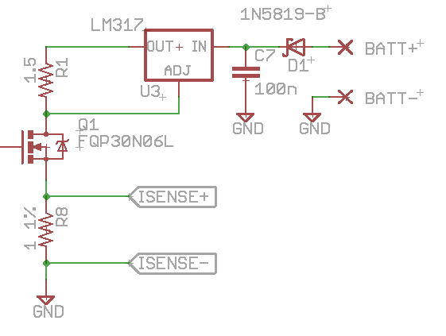
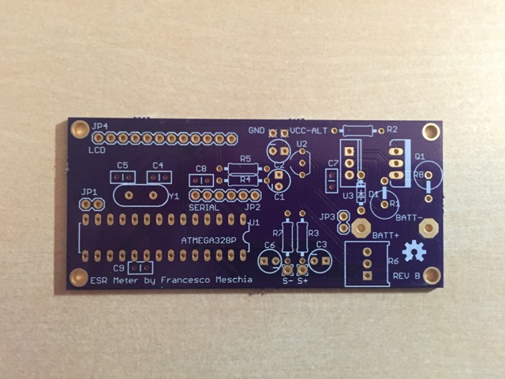
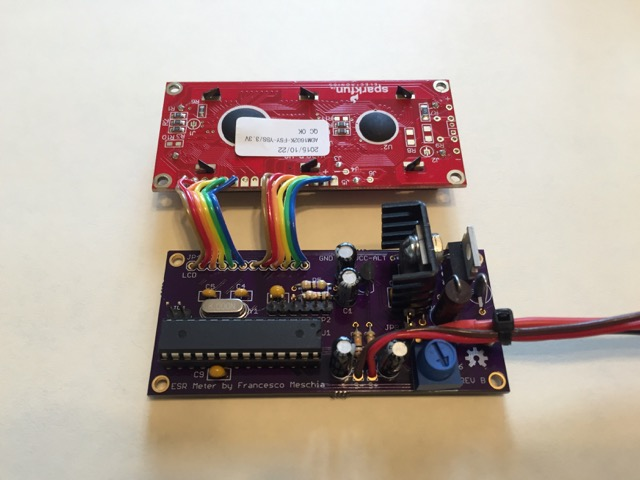
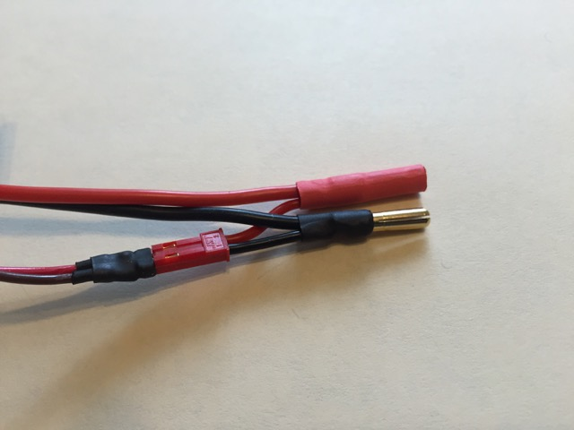
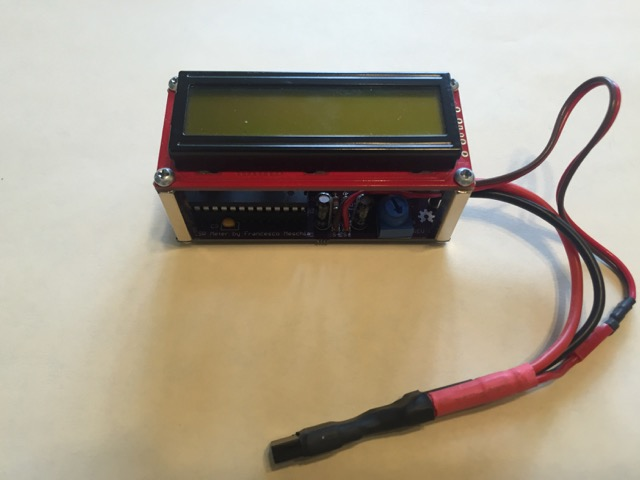

ESR Meter
=========
An Arduino-based battery internal resistance meter.

Introduction
------------
This device measures the internal resistance of a battery by measuring the voltage difference at the battery terminals when a load is applied and then removed. By measuring the difference in voltage and the difference in current, the resistance is readily determined via Ohm's law.

Design goals
------------
* Measure internal resistance for batteries with voltages ranging from a 4-cell NiXX to a 4S LiPo pack
* Resistance range: 1 to 1000 mOhm
* Ability to do 4-wire measurements
* Target precision: 2% ± 1 LSB
* Ability to draw power either from the battery under test, or from a separate battery
* Powered by the Atmel ATMega328P microcontroller (so that it can be prototyped with Arduino)
* Low cost!

Design
------

This device measures the internal resistance by using Ohm's law: R = ∆V/∆I. The battery is first connected to a load, then the load is removed. The voltage at the battery teminals is measured just before removing the load, and just after the load is removed. The current drawn from the battery is also measured, almost simultaneously with the two voltage measurements.

Voltage and current measurement is performed using a 4-wire (Kelvin) technique: current is measured by a sensing resistor along the "hot" high-current path which connects the battery to the load, and voltage is sensed through two "cold" leads, that carry no current. This also allows for internal resistance measurement of the individual cells in a multi-cell battery, as long as the individual cell voltages are available at a balance tap.

One of the problems that must be solved is how to measure voltages (like the two battery under test terminals) which may exceed the ADC reference voltage. The ATMega328P microcontroller can be powered with 5.5V maximum, so if we were to do a direct measurement (battery terminals direct to ADC inputs) we would be only be able to measure a 4-cell NiXX battery... if it's not fully charged.

One possibility to overcome this problem would be to use differential analog amplifiers to bring the voltages within the measurement range. The gain and the baseline of the amplifiers could be adjusted by the micro with digital potentiometers, to adapt to different battery voltages. The drawback is the number of additional components, which influences the cost of the device.

Instead of going this route, we decided to use "AC coupling". The voltages sensed at the battery terminals are filtered through one-pole (RC) low-pass filters, so that their DC component is removed. If the time constant of the fiter is sufficiently long compared to the load-switching-to-measurement delay, we would only measure the actual change in voltage, with negligible error (compare, in the scope plot below, the yellow DC-coupled voltage at the positive battery terminal with the green AC-coupled signal: 1 ms after the load is switched off, when the measurement is taken, the AC-coupled signal is a very faithful estimate of the voltage difference at the battery terminal).

 vs. AC (green) measure of ∆V")

In order to ensure reasonable precision with low cost, we also decided to reference the ADCs to the internal bandgap voltage reference of the micro. This means that, if we want to meet the 1 Ohm maximum range stated in the design goals, we need to draw less than about 1.1 A (we designed the prototype for 0.8 A).

Such an electronic load can be conveniently built with a LM317 regulator used as a current source. This will be the heart of the "hot" loop. Additionally, the hot loop will also include: 

*  a Schottky diode for protection against reverse polarity
*  an n-channel MOSFET used as a switch
*  a 1 Ohm, 1% precision, current sensing resistor

Mainly because of the LM317 dropout characteristics, the minimum voltage that needs to be applied to the hot loop if we want the design current draw is about 4 V. A lower voltage would lead to a lower current figure, as long as it is enough to correctly bias the BJTs inside the LM317 (after that, the device won't work any more). We tested the circuit with a single LiPo cell discharged to 3.5V, without any problem.

The hot loop is switched on and off by the microcontroller, which we decided to power at 3.3 V with an external clock runing at 8 MHz. The program running on the micro switches on the load for 500 ms, then switches it off for 1500 ms, before starting a new cycle. In this way, the 25% duty cycle helps in keeping the average power dissipation acceptable for a LM317 with a passive heat sink, even when sinking current from a 4S LiPo battery.

The microcontroller also drives a standard HD44780 2x16 parallel-interface LCD display module, to output the result of the internal resistance computation at the end of each 2-second measurement cycle. The measurement is automatically refreshed every 2 seconds, for as long as the unit is powered. 

Power for the circuit may come either directly from the battery under test (requires the use of a LDO regulator and a 3.3 V display module), or from a separate battery.

Making it
---------
The project includes Eagle files for both the schematics and the board. The board was designed as a 2-layer PCB with the same 80x36 mm form factor used by standard 2x16 LCD modules, and with the same mounting hole pattern, so that it can be stacked using 1" standoffs.

The Bill of Materials is also included in the project. Here are some component selection notes:

* it is important for precision to use a 1 Ohm, 1% current sensing resistor (R8 in the schematic);
* the reverse-polarity protection diode used in the hot loop (D1 in the schematic) can be replaced with a more common 1N4001 diode, but this increases the voltage drop along the hot loop and may create problems to the LM317 electronic load. If you plan to build this circuit for single-LiPo or 4S NiXX use, it is best to stick with a Schottky diode;
* the Q1 n-channel MOSFET is not critical, as long as it can reliably switch completely on with a 3.3 V gate-to-source voltage. For single-LiPo or 4 NiXX operation, a low "on" drain-to-source resistance is advisable. The FQP30N06L we suggest in the schematic has just 0.035 Ohms of forward resistance when fully "on".
* any 3.3 V low-dropout linear regulator can be used for single-battery operation. The board is designed for the footprint of a L4931. 
* the LM317 used as a current source requires a heat sink for reliable operation. The sink resistor, R1, will dissipate 1 W and must therefore be sized accordingly.

Other notes:

* the board includes two jumper headers. One, labeled "JP3", determines whether the board will be powered from the battery under test (if closed), or from an external battery (if open). In the latter case, a suitable power source must be provided at the via labeled "VCC-ALT".
* the other jumper, JP1, if closed forces the software running in the ATMega328P to show debug information (sensed voltages and currents) in addition to the resistance value.
* another header, JP2, provides an interface to the serial port of the ATMega328P. It is pin-compatible (but pay attention to the correct orientation!) with the FTDI FT232L breakout board offered by Sparkfun (https://www.sparkfun.com/products/9873). The serial port can be used to upload the software into the microcontroller if an Arduino bootloader is used.

Assembly notes:

* the LCD module is to be connected to the board with a short length of 6-lead ribbon cable. The 6 leftmost pins of JP4 go to pins 1 to 6 on the LCD module, and the 6 rightmost pins go to pins 11 to 16.
* the battery under test is to be connected to the "hot" loop through the two plated holes labeled BATT+ and BATT- on the board, of course while respecting the polarity, using two suitable wires; the holes should be able to accommodate up to AWG16. The two voltage sense leads will be soldered to the plated holes labeled S+ and S-; polarity in that case is not important, as the software can accommodate reverse polarity.
* The voltage sense leads do not necessarily need to be soldered to the battery connectors. For multiple-cell LiPo use, they can be soldered to a suitable pitch 2-pin header to sense the individual cells at the balancing connector (see picture below).

The following are some pictures of a specimen of the device:

